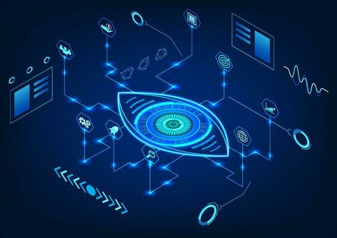

# FreeGaze - Sistema de Controle Ocular  



## 📌 Sobre o Projeto  
Sistema que detecta **piscadas** e **direção do olhar** para interação hands-free, voltado para acessibilidade e automação residencial.  

## 🛠 Funcionalidades  
- Detecção de piscadas (`PISCOU`).  
- Identificação da direção do olhar (`ESQUERDA`, `DIREITA`, `CIMA`, `BAIXO`).  
- Registro de comandos em arquivo `comandos_oculares.txt`.  

## ⚙️ Como Usar  
1. **Pré-requisitos**:  
   ```bash
   pip install opencv-python face-recognition numpy

Execução:

bash
python src/Eyevision_Final_Fix.py

Saída:

Comandos salvos em data/comandos_oculares.txt.

📂 Estrutura do Projeto
FreeGaze/  
│
├── docs/                       # Documentação do projeto
│   └── documento.md           
│
├── src/                        # Código-fonte
│   └── main.py                 # Código principal 
│  
│
├── data/                       # Dados de exemplo (vídeos, imagens, logs)
│   └── comandos_oculares.txt   # Arquivo de saída gerado pelo código
│    
│
└── README.md                   # Arquivo principal de documentação

🤝 Como Contribuir
Faça um fork do projeto.

Crie uma branch: git checkout -b minha-feature.

Envie um pull request.

📜 Licença
MIT
